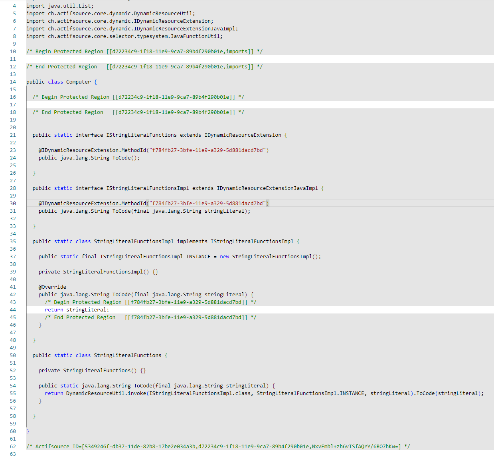

# ch.actifsource.example.vscode
In this project we will show how to highlight protected regions inside VSCode.





## Install VSCode Extension

Install the Extension 'Highlight' from [Marketplace](https://marketplace.visualstudio.com/items?itemName=fabiospampinato.vscode-highlight)

## Add settings.json

Add the content from the setting file to your VSCode workspace [(Settings.json)](settings.json).

```
{
    "highlight.maxMatches": 25, 
    "highlight.regexes": { 
     // Actifsource without protected regions 
	 "(^((?!\\s*(#|/\\*|//) (Begin|End) Protected Region\\s+\\[\\S+\\]( \\*/)?).*\\r?\\n)*?(\\s*(#|/\\*|//) Actifsource ID=\\[\\S+\\]( \\*/)?))": {
	    "regexFlags": "", 
		"filterFileRegex": ".*\\.(h|c|hpp|cpp|java|ts)",
		"decorations": [
		  {
		    "backgroundColor": "rgba(0,0,0,0.1)",
		    "isWholeLine": true 
		  } 
		] 
	  }, 
	  // Start to first protected region 
	  "(^(.*\\r?\\n)*?(\\s*(#|/\\*|//) Begin Protected Region\\s+\\[\\S+\\]( \\*/)?))": {
	    "regexFlags": "",
		"filterFileRegex": ".*\\.(h|c|hpp|cpp|java|ts)",
		"decorations": [ 
		  { 
		    "backgroundColor": "rgba(0,0,0,0.1)",
		    "isWholeLine": true 
		  } 
		] 
      }, 
	  // Inbetween two protected regions 
	  "(((#|/\\*|//) End Protected Region\\s+\\[\\S+\\]( \\*/)?)(.*\\r?\\n)*?(\\s*(#|/\\*|//) Begin Protected Region\\s+\\[\\S+\\]( \\*/)?))": {
	    "regexFlags": "g", 
		"filterFileRegex": ".*\\.(h|c|hpp|cpp|java|ts)",
		"decorations": [
		  { 
		    "backgroundColor": "rgba(0,0,0,0.1)",
			"isWholeLine": true 
	      } 
		] 
	  },
	  // Last protected region to end of document 
	  "(((#|/\\*|//) End Protected Region\\s+\\[\\S+\\]( \\*/)?)((?!\\s*(#|/\\*|//) (Begin|End) Protected Region).*\\r?\\n)*?(\\s*(#|/\\*|//) Actifsource ID=\\[\\S+\\]( \\*/)?))": {
	    "regexFlags": "",
		"filterFileRegex": ".*\\.(h|c|hpp|cpp|java|ts)",
		"decorations": [ 
		  {
		    "backgroundColor": "rgba(0,0,0,0.1)",
			"isWholeLine": true 
	      } 
		] 
	  } 
    }
}
```

